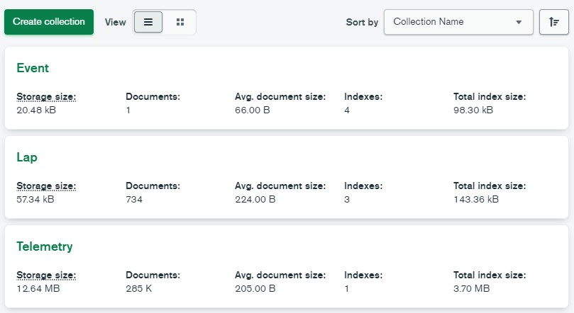

# Nikita

 Why Nikita you may ask? The answer is simple, this test is shit like Nikita Mazepin :(

# Report

## Schemas
### Event
```
class Event(Document):
    year: Indexed(int)
    session: Indexed(str)
    round: Indexed(str)
```
### Lap
```
class Lap(Document):
    lap_time: Indexed(float)
    driver_number: int
    driver: Indexed(str)
    lap_number : int
    sector_1_time: float
    sector_2_time: float
    sector_3_time: float
    compound: str
    event: Link[Event]
```
### Telemetry
```
class Telemetry(Document):
    rpm: int
    speed: float
    gear: int
    throttle : int
    brake: bool
    drs: int
    time: float
    distance: float
    lap: Link[Lap]
    event: Link[Event]
```
### Memory Usage
Currently only car data telemetry is loaded as telemetry, the image below represent a possible memory usage for a single session (Race session of 2022 Bahrain Grand Prix)

